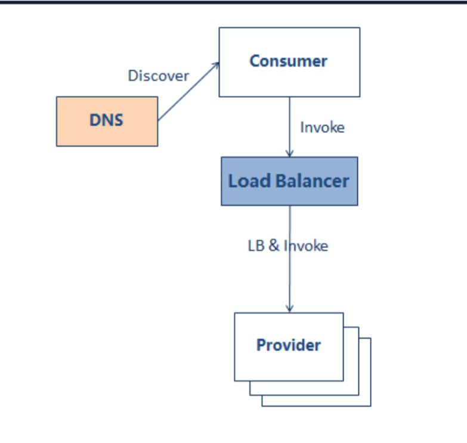
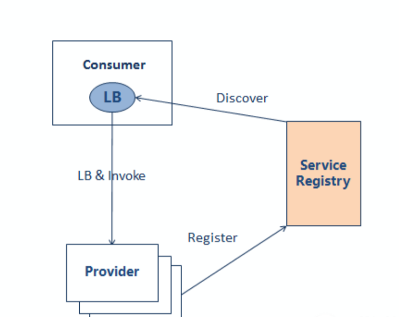
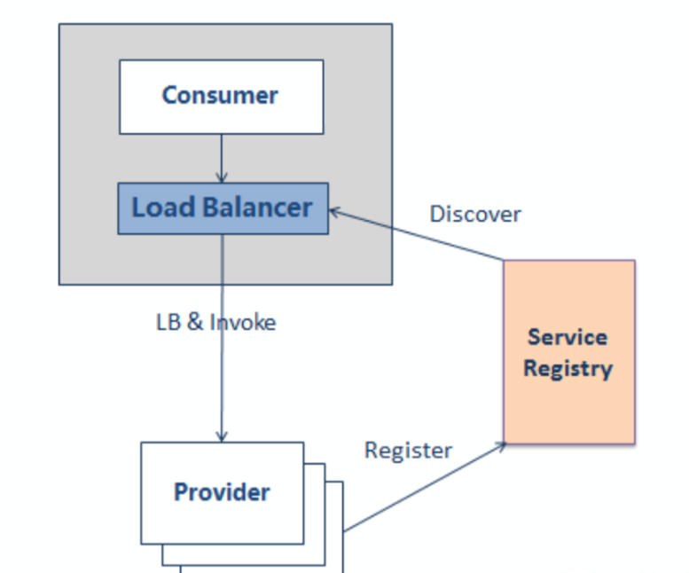

# 服务注册与发现中负载方案选型

常见的服务注册与发现的方案有三种。

## 集中式负载均衡方案
集中式负载均衡也叫服务端负载均衡，如图所示，负载均衡器在一台单独的主机上，
可以采用软负载，如nginx，apache等，也可以采用硬负载，如F5等，
它负责多实例服务的负载均衡，客户端直接通过域名访问负载均衡器，
DNS服务器将域名解析到负载均衡器IP上。  

  

该方案实现较为简单，仍是业界的主流，可以充分利用负载均衡器的能力，
根据不同的负载策略将请求分发到后面的服务实例上；同时，该方案缺点也很明显，
负载均衡器存在单点问题，所有的流量都需要通过负载均衡器，
如果负载均衡器存在问题，则直接导致服务不能正常提供服务；
中间经过负载均衡器做代理，性能也有一定损耗。

## 客户端负载均衡方案

客户端负载针对服务端负载的缺点，做了一定的改进，如图所示，
负载能力由客户端进程提供，服务端实例注册自己的地址到注册中心，
客户端从注册中心订阅服务提供者的地址，获取地址后，
根据负载均衡实现策略进行服务路由：

  

该方案在解决了服务端负载的单点问题，每个客户端都实现了自己的负载功能，
负载能力和客户端进程在一起，和客户端的生命周期一致，
如果负载均衡进程down了，则客户端也down了，而且只影响本身客户端，
不会影响其他客户端；同时，该方案也有一定的缺点，负载要求每个客户端自己实现，
如果不同的技术栈，每个客户端则需要使用不同的语言实现自己的负载能力，
技术难度较大；业界的motan，dubbo采用此方案做服务注册与发现。

## 客户端主机独立负载均衡方案  

第三种方案综合了前2个方案的优缺点，如图所示，服务发现和负载的能力从客户端
进程移出，客户端进程和负载均衡进程是2个独立的进程，在同一个主机上；
服务实例还是在启动的时候注册自己的地址到注册中心，客户端直接发送请求给本
机的负载均衡器。

 

该方案是一个典型的分布式方案，没有单点问题，如果一个主机的负载均衡器出问题，
只影响一个节点调用，不影响其他的节点，负载均衡器本身负载也较小，性能损耗较低；
同时也不需要多种语言实现自己的负载能力，负载能力是公用的；但是该方案部署复杂，
维护困难，出了异常之后，调试负载，定位问题都比较麻烦。
